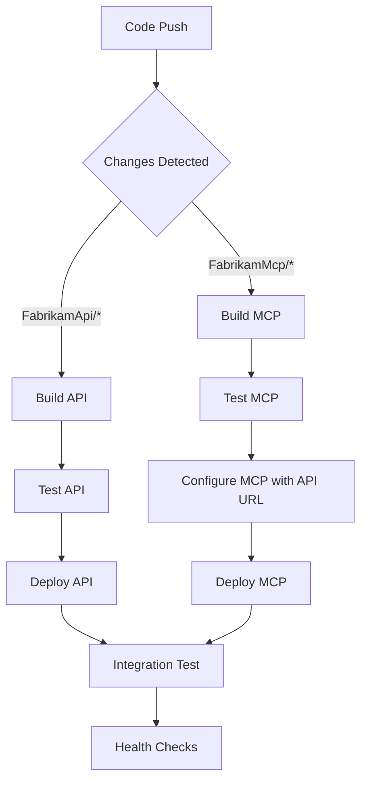

# 🚀 Azure Deployment & CI/CD Setup Guide

This guide walks through setting up automated deployments for both FabrikamApi and FabrikamMcp from a single repository using GitHub Actions.

## 🎯 Deployment Architecture

```
Single Repository (Monorepo)
├── FabrikamApi/          ← Deployed to Azure App Service
├── FabrikamMcp/          ← Deployed to Azure App Service  
├── .github/workflows/    ← CI/CD pipelines
└── Shared resources      ← Documentation, scripts, configs
```

### Benefits of This Approach:
- ✅ **Single source of truth** for both applications
- ✅ **Coordinated deployments** with dependency management
- ✅ **Shared CI/CD configuration** and secrets
- ✅ **Simplified repository management**
- ✅ **Easy cross-service integration** and testing

---

## � Prerequisites

Before starting the deployment, ensure you have:

- **Azure CLI** installed and updated to the latest version
- **PowerShell** (Windows PowerShell or PowerShell Core)
- **Azure subscription** with Contributor access
- **GitHub account** for repository and CI/CD setup

### Azure CLI Extensions

The deployment scripts will automatically install required Azure CLI extensions using:
```powershell
az config set extension.use_dynamic_install=yes_without_prompt
```

This automatically installs extensions like:
- `application-insights` - For Application Insights management
- `log-analytics` - For Log Analytics workspace operations  
- `webapp` - For enhanced App Service features

### Custom Domain Setup

If you plan to use custom domains, ensure you have:
- **DNS control** for your domain (e.g., levelupcsp.com)
- **SSL certificate** for HTTPS (App Service Certificate or Let's Encrypt)
- **CNAME records** configured before running the deployment

Required DNS records:
```
fabrikam-api-dev.levelupcsp.com    CNAME   fabrikam-api-dev-izbd.azurewebsites.net
fabrikam-mcp-dev.levelupcsp.com    CNAME   fabrikam-mcp-dev-izbd.azurewebsites.net
```

---

## �🛠️ Pre-Deployment Setup

### 1. Azure Resources Setup

#### Option 1: Use the Automated Script (Recommended)

Use the provided PowerShell script for easier deployment:

```powershell
# Basic deployment
.\Deploy-Azure-Resources.ps1 -SubscriptionId "your-subscription-id"

# With custom domain
.\Deploy-Azure-Resources.ps1 `
  -SubscriptionId "your-subscription-id" `
  -Environment "dev" `
  -CustomDomain "levelupcsp.com"

# Production deployment
.\Deploy-Azure-Resources.ps1 `
  -SubscriptionId "your-subscription-id" `
  -Environment "prod" `
  -CustomDomain "levelupcsp.com" `
  -Location "East US"
```

#### Option 2: Manual Step-by-Step

Create Azure resources for each environment manually:

```powershell
# Set variables
$environment = "dev"  # or "staging", "production"
$location = "East US 2" # or "East US"
$resourceGroup = "rg-fabrikam-$environment"
$subscriptionId = "your-subscription-id-here"
$customDomain = "levelupcsp.com"  # Replace with your custom domain

# Generate random suffix for globally unique resource names (4 characters)
$randomSuffix = -join ((65..90) + (97..122) | Get-Random -Count 4 | ForEach-Object {[char]$_})
Write-Host "Using random suffix: $randomSuffix" -ForegroundColor Green

# Configure Azure CLI to auto-install extensions without prompting
az config set extension.use_dynamic_install=yes_without_prompt

# Create resource group
az group create --name $resourceGroup --location $location

# Create Log Analytics Workspace (shared for monitoring)
az monitor log-analytics workspace create `
  --resource-group $resourceGroup `
  --workspace-name "log-fabrikam-$environment" `
  --location $location

# Get Log Analytics Workspace ID for Application Insights
$workspaceId = az monitor log-analytics workspace show `
  --resource-group $resourceGroup `
  --workspace-name "log-fabrikam-$environment" `
  --query id --output tsv

# Create Application Insights instances
az monitor app-insights component create `
  --app "appi-fabrikam-api-$environment" `
  --location $location `
  --resource-group $resourceGroup `
  --workspace $workspaceId `
  --kind web `
  --application-type web

az monitor app-insights component create `
  --app "appi-fabrikam-mcp-$environment" `
  --location $location `
  --resource-group $resourceGroup `
  --workspace $workspaceId `
  --kind web `
  --application-type web

# Get Application Insights connection strings
$apiInsightsKey = az monitor app-insights component show `
  --app "appi-fabrikam-api-$environment" `
  --resource-group $resourceGroup `
  --query connectionString --output tsv

$mcpInsightsKey = az monitor app-insights component show `
  --app "appi-fabrikam-mcp-$environment" `
  --resource-group $resourceGroup `
  --query connectionString --output tsv

# Create App Service Plans
az appservice plan create `
  --name "plan-fabrikam-api-$environment" `
  --resource-group $resourceGroup `
  --sku B1 --is-linux

az appservice plan create `
  --name "plan-fabrikam-mcp-$environment" `
  --resource-group $resourceGroup `
  --sku B1 --is-linux

# Create Web Apps with random suffixes for global uniqueness
$apiAppName = "fabrikam-api-$environment-$randomSuffix"
$mcpAppName = "fabrikam-mcp-$environment-$randomSuffix"

Write-Host "Creating API app: $apiAppName" -ForegroundColor Yellow
az webapp create `
  --name $apiAppName `
  --resource-group $resourceGroup `
  --plan "plan-fabrikam-api-$environment" `
  --runtime "DOTNETCORE:9.0"

Write-Host "Creating MCP app: $mcpAppName" -ForegroundColor Yellow
az webapp create `
  --name $mcpAppName `
  --resource-group $resourceGroup `
  --plan "plan-fabrikam-mcp-$environment" `
  --runtime "DOTNETCORE:9.0"

# Configure Application Insights for Web Apps
az webapp config appsettings set `
  --name $apiAppName `
  --resource-group $resourceGroup `
  --settings "APPLICATIONINSIGHTS_CONNECTION_STRING=$apiInsightsKey" `
             "ApplicationInsightsAgent_EXTENSION_VERSION=~3" `
             "ASPNETCORE_ENVIRONMENT=$environment"

az webapp config appsettings set `
  --name $mcpAppName `
  --resource-group $resourceGroup `
  --settings "APPLICATIONINSIGHTS_CONNECTION_STRING=$mcpInsightsKey" `
             "ApplicationInsightsAgent_EXTENSION_VERSION=~3" `
             "ASPNETCORE_ENVIRONMENT=$environment" `
             "FabrikamApi__BaseUrl=https://$apiAppName.azurewebsites.net"

# Configure custom domains (optional - requires DNS setup)
if ($customDomain) {
    Write-Host "Setting up custom domains..." -ForegroundColor Cyan
    
    # Custom domain names
    $apiCustomDomain = "fabrikam-api-$environment.$customDomain"
    $mcpCustomDomain = "fabrikam-mcp-$environment.$customDomain"
    
    Write-Host "API will be available at: https://$apiCustomDomain" -ForegroundColor Green
    Write-Host "MCP will be available at: https://$mcpCustomDomain" -ForegroundColor Green
    
    # Add custom domains (DNS must be configured first)
    Write-Host "Adding custom domain for API..." -ForegroundColor Yellow
    az webapp config hostname add `
      --webapp-name $apiAppName `
      --resource-group $resourceGroup `
      --hostname $apiCustomDomain
    
    Write-Host "Adding custom domain for MCP..." -ForegroundColor Yellow
    az webapp config hostname add `
      --webapp-name $mcpAppName `
      --resource-group $resourceGroup `

      --hostname $mcpCustomDomain
    
    # Enable HTTPS for custom domains (requires App Service Certificate or Let's Encrypt)
    Write-Host "Enabling HTTPS for custom domains..." -ForegroundColor Yellow
    az webapp config ssl bind `
      --certificate-thumbprint "your-certificate-thumbprint" `
      --ssl-type SNI `
      --name $apiAppName `
      --resource-group $resourceGroup
    
    az webapp config ssl bind `
      --certificate-thumbprint "your-certificate-thumbprint" `
      --ssl-type SNI `
      --name $mcpAppName `
      --resource-group $resourceGroup
    
    # Update MCP app settings to use custom API domain
    az webapp config appsettings set `
      --name $mcpAppName `
      --resource-group $resourceGroup `
      --settings "FabrikamApi__BaseUrl=https://$apiCustomDomain"
}

# Display final URLs
Write-Host "`n=== Deployment Complete ===" -ForegroundColor Green
Write-Host "API App Name: $apiAppName" -ForegroundColor Cyan
Write-Host "MCP App Name: $mcpAppName" -ForegroundColor Cyan
Write-Host "`nDefault URLs:" -ForegroundColor White
Write-Host "  API: https://$apiAppName.azurewebsites.net" -ForegroundColor Yellow
Write-Host "  MCP: https://$mcpAppName.azurewebsites.net" -ForegroundColor Yellow

if ($customDomain) {
    Write-Host "`nCustom URLs (after DNS setup):" -ForegroundColor White
    Write-Host "  API: https://api-$environment.$customDomain" -ForegroundColor Green
    Write-Host "  MCP: https://mcp-$environment.$customDomain" -ForegroundColor Green
}
```

### 2. Service Principal Creation

Create a service principal for GitHub Actions:

```powershell
# Configure Azure CLI to auto-install extensions (if not already set)
az config set extension.use_dynamic_install=yes_without_prompt

# Create service principal with contributor access (New method - recommended)
# Note: --years parameter limits credential lifetime to comply with tenant policies
$sp = az ad sp create-for-rbac `
  --name "sp-fabrikam-deploy" `
  --role "Contributor" `
  --scopes "/subscriptions/$subscriptionId" `
  --years 1

# Alternative: If 1 year is still too long, try without --years (uses default ~2 years)
# and let Azure apply the tenant policy limit automatically
# $sp = az ad sp create-for-rbac `
#   --name "sp-fabrikam-deploy" `
#   --role "Contributor" `
#   --scopes "/subscriptions/$subscriptionId"

# Save the JSON output - you'll need this for GitHub secrets
echo $sp

# Alternative: If you need the old SDK format, manually format the output
$spObject = $sp | ConvertFrom-Json
$sdkFormat = @{
    clientId = $spObject.appId
    clientSecret = $spObject.password
    subscriptionId = $subscriptionId
    tenantId = $spObject.tenant
    activeDirectoryEndpointUrl = "https://login.microsoftonline.com"
    resourceManagerEndpointUrl = "https://management.azure.com/"
    activeDirectoryGraphResourceId = "https://graph.windows.net/"
    sqlManagementEndpointUrl = "https://management.core.windows.net:8443/"
    galleryEndpointUrl = "https://gallery.azure.com/"
    managementEndpointUrl = "https://management.core.windows.net/"
}

# Convert to JSON for GitHub secret
$sdkFormat | ConvertTo-Json
```

### 3. GitHub Repository Setup

#### Required GitHub Secrets:

Navigate to your GitHub repository → Settings → Secrets and variables → Actions:

| Secret Name | Description | Example Value |
|-------------|-------------|---------------|
| `AZURE_CREDENTIALS` | Service principal JSON from step 2 | `{"clientId": "...", "clientSecret": "...", ...}` |
| `AZURE_SUBSCRIPTION_ID` | Your Azure subscription ID | `12345678-1234-1234-1234-123456789012` |
| `AZURE_RESOURCE_GROUP_NAME` | Resource group name | `rg-fabrikam-dev` |

#### Optional GitHub Variables:

| Variable Name | Description | Default Value |
|---------------|-------------|---------------|
| `AZURE_LOCATION` | Azure region for deployments | `East US` |
| `DOTNET_VERSION` | .NET version to use | `9.0.x` |

---

## 🔄 CI/CD Workflows

### Available Workflows:

#### 1. **Individual Service Deployment**
- **`deploy-api.yml`** - Deploys only FabrikamApi
- **`deploy-mcp.yml`** - Deploys only FabrikamMcp

#### 2. **Full Stack Deployment**  
- **`deploy-full-stack.yml`** - Deploys both services with coordination

### Workflow Triggers:

#### Automatic Triggers:
- **Push to main branch** - Deploys to development environment
- **Path-based triggers** - Only deploys services that changed
  - Changes to `FabrikamApi/` → Triggers API deployment
  - Changes to `FabrikamMcp/` → Triggers MCP deployment

#### Manual Triggers:
- **Workflow Dispatch** - Manual deployment with environment selection
- **Environment Selection** - Choose development, staging, or production
- **Service Selection** - Deploy API only, MCP only, or both

### Deployment Process:



---

## 🌍 Environment Management

### Environment Strategy:

| Environment | Branch | Purpose | Auto-Deploy |
|-------------|--------|---------|-------------|
| **Development** | `main` | Latest stable code | ✅ Yes |
| **Staging** | `release/*` | Pre-production testing | ✅ Yes |
| **Production** | `production` | Live environment | ❌ Manual only |

### Environment-Specific Configuration:

#### Development
```bash
# App Names (with random suffix for uniqueness)
AZURE_API_WEBAPP_NAME=fabrikam-api-dev-{randomSuffix}
AZURE_MCP_WEBAPP_NAME=fabrikam-mcp-dev-{randomSuffix}

# Default URLs
API_URL=https://fabrikam-api-dev-{randomSuffix}.azurewebsites.net
MCP_URL=https://fabrikam-mcp-dev-{randomSuffix}.azurewebsites.net

# Custom Domain URLs (if configured)
API_CUSTOM_URL=https://api-dev.levelupcsp.com
MCP_CUSTOM_URL=https://mcp-dev.levelupcsp.com
```

#### Production
```bash
# App Names (with random suffix for uniqueness)
AZURE_API_WEBAPP_NAME=fabrikam-api-prod-{randomSuffix}
AZURE_MCP_WEBAPP_NAME=fabrikam-mcp-prod-{randomSuffix}

# Default URLs
API_URL=https://fabrikam-api-prod-{randomSuffix}.azurewebsites.net
MCP_URL=https://fabrikam-mcp-prod-{randomSuffix}.azurewebsites.net

# Custom Domain URLs (if configured)
API_CUSTOM_URL=https://api.levelupcsp.com
MCP_CUSTOM_URL=https://mcp.levelupcsp.com
```

---

## 🧪 Testing & Validation

### Automated Testing Pipeline:

1. **Unit Tests** - Run during build for both services
2. **Integration Tests** - Verify API-MCP communication
3. **Health Checks** - Ensure services are responding
4. **Smoke Tests** - Basic functionality validation

### Health Check Endpoints:

```bash
# API Health Check
curl https://fabrikam-api-{env}.azurewebsites.net/health

# MCP Status Check  
curl https://fabrikam-mcp-{env}.azurewebsites.net/status

# API Documentation
https://fabrikam-api-{env}.azurewebsites.net/swagger
```

### Post-Deployment Validation:

```powershell
# Test API connectivity
$apiUrl = "https://fabrikam-api-dev.azurewebsites.net"
$mcpUrl = "https://fabrikam-mcp-dev.azurewebsites.net"

# Check API health
Invoke-RestMethod "$apiUrl/health"

# Check MCP status
Invoke-RestMethod "$mcpUrl/status"

# Verify MCP can reach API
$mcpStatus = Invoke-RestMethod "$mcpUrl/status"
Write-Host "MCP connected to API: $($mcpStatus.ApiConnected)"
```

---

## 🛠️ Manual Deployment

### Using Azure Developer CLI (AZD):

```powershell
# Option 1: Deploy individually
cd FabrikamApi
azd up

cd ../FabrikamMcp
azd env set FABRIKAM_API_BASE_URL "https://fabrikam-api-dev.azurewebsites.net"
azd up

# Option 2: Use coordinated script
.\Deploy-Integrated.ps1 -EnvironmentName "dev" -Location "eastus"
```

### Using GitHub Actions Manually:

1. Go to **Actions** tab in your GitHub repository
2. Select **Deploy Full Stack** workflow
3. Click **Run workflow**
4. Choose environment and services to deploy
5. Monitor deployment progress

---

## 🔧 Configuration Management

### Service-to-Service Communication:

The MCP server needs to know the API URL. This is configured automatically during deployment:

```yaml
# In deploy-mcp.yml
- name: ⚙️ Configure App Settings
  run: |
    az webapp config appsettings set \
      --name ${{ env.AZURE_WEBAPP_NAME }} \
      --resource-group ${{ secrets.AZURE_RESOURCE_GROUP_NAME }} \
      --settings "FabrikamApi__BaseUrl=${{ steps.get-api-url.outputs.api_url }}"
```

### Environment Variables in Azure:

| Service | Setting | Purpose |
|---------|---------|---------|
| **FabrikamApi** | `ASPNETCORE_ENVIRONMENT` | Runtime environment |
| **FabrikamMcp** | `FabrikamApi__BaseUrl` | API connection string |
| **Both** | `AZURE_CLIENT_ID` | Managed identity (if used) |

---

## 🚨 Troubleshooting

### Common Issues:

#### 1. **Deployment Fails**
```bash
# Check GitHub Actions logs
# Look for specific error messages in the workflow run

# Check Azure deployment logs
az webapp log tail --name fabrikam-api-dev --resource-group rg-fabrikam-dev
```

#### 2. **MCP Can't Connect to API**
```bash
# Verify MCP configuration
az webapp config appsettings list --name fabrikam-mcp-dev --resource-group rg-fabrikam-dev

# Test API accessibility
curl https://fabrikam-api-dev.azurewebsites.net/health
```

#### 3. **GitHub Actions Permission Issues**
```bash
# Verify service principal has correct permissions
az role assignment list --assignee {service-principal-client-id}

# Check if resource group exists
az group show --name rg-fabrikam-dev
```

#### 4. **Custom Domain Issues**
```bash
# Verify DNS configuration
nslookup api-dev.levelupcsp.com

# Check custom domain status
az webapp config hostname list --webapp-name your-app-name --resource-group your-rg

# Verify SSL certificate binding
az webapp config ssl list --resource-group your-rg

# Test custom domain access
curl -I https://api-dev.levelupcsp.com/health
```

#### 5. **App Name Already Taken**
If you get "The name 'your-app-name' is not available":
```bash
# The script generates random suffixes, but if still taken:
# Manually set a different suffix
$randomSuffix = "xyz9"

# Or generate a new random suffix
$randomSuffix = -join ((65..90) + (97..122) | Get-Random -Count 6 | ForEach-Object {[char]$_})
```

#### 6. **Service Principal Credential Lifetime Error**
If you get "Credential lifetime exceeds the max value allowed" due to tenant policies:

```bash
# Method 1: Let tenant policy apply automatically (RECOMMENDED)
# This creates the service principal with whatever credential lifetime your tenant allows
# Option A: Resource group-wide Contributor access (less secure but simpler)
# $resourceGroupScope = "/subscriptions/$subscriptionId/resourceGroups/rg-fabrikam-dev"
# $sp = az ad sp create-for-rbac `
#   --name "sp-fabrikam-deploy" `
#   --role "Contributor" `
#   --scopes $resourceGroupScope

# Option B: Web app-specific Website Contributor access (MOST SECURE - RECOMMENDED)
# First, get the web app resource IDs (after creating the web apps)
$apiAppScope = "/subscriptions/$subscriptionId/resourceGroups/rg-fabrikam-dev/providers/Microsoft.Web/sites/fabrikam-api-dev-$randomSuffix"
$mcpAppScope = "/subscriptions/$subscriptionId/resourceGroups/rg-fabrikam-dev/providers/Microsoft.Web/sites/fabrikam-mcp-dev-$randomSuffix"

# Create service principal with Website Contributor role on specific web apps
$sp = az ad sp create-for-rbac `
  --name "sp-fabrikam-deploy" `
  --role "Website Contributor" `
  --scopes $apiAppScope $mcpAppScope `
  --years 0

# Method 2: Use Workload Identity Federation (RECOMMENDED for production)
# This is more secure and doesn't have credential expiration issues
# Step 1: Create service principal without credentials (web app scoped)
$apiAppScope = "/subscriptions/$subscriptionId/resourceGroups/rg-fabrikam-dev/providers/Microsoft.Web/sites/fabrikam-api-dev-$randomSuffix"
$mcpAppScope = "/subscriptions/$subscriptionId/resourceGroups/rg-fabrikam-dev/providers/Microsoft.Web/sites/fabrikam-mcp-dev-$randomSuffix"

$sp = az ad sp create-for-rbac `
  --name "sp-fabrikam-deploy" `
  --role "Website Contributor" `
  --scopes $apiAppScope $mcpAppScope `
  --skip-assignment

# Step 2: Configure federated credential for GitHub
$spObject = $sp | ConvertFrom-Json
az ad app federated-credential create `
  --id $spObject.appId `
  --parameters '{
    "name": "github-deploy",
    "issuer": "https://token.actions.githubusercontent.com",
    "subject": "repo:davebirr/Fabrikam-Project:ref:refs/heads/main",
    "description": "GitHub Actions deployment",
    "audiences": ["api://AzureADTokenExchange"]
  }'

# Step 3: Assign role to service principal (web app scoped)
$apiAppScope = "/subscriptions/$subscriptionId/resourceGroups/rg-fabrikam-dev/providers/Microsoft.Web/sites/fabrikam-api-dev-$randomSuffix"
$mcpAppScope = "/subscriptions/$subscriptionId/resourceGroups/rg-fabrikam-dev/providers/Microsoft.Web/sites/fabrikam-mcp-dev-$randomSuffix"

az role assignment create `
  --assignee $spObject.appId `
  --role "Website Contributor" `
  --scope $apiAppScope

az role assignment create `
  --assignee $spObject.appId `
  --role "Website Contributor" `
  --scope $mcpAppScope

# Method 3: Create app registration manually (if automated methods fail)
# Step 1: Create app registration
$app = az ad app create --display-name "sp-fabrikam-deploy" | ConvertFrom-Json

# Step 2: Create service principal for the app
$sp = az ad sp create --id $app.appId | ConvertFrom-Json

# Step 3: Create a client secret (respects tenant policy)
$credential = az ad app credential reset --id $app.appId | ConvertFrom-Json

# Step 4: Assign role (web app scoped)
$apiAppScope = "/subscriptions/$subscriptionId/resourceGroups/rg-fabrikam-dev/providers/Microsoft.Web/sites/fabrikam-api-dev-$randomSuffix"
$mcpAppScope = "/subscriptions/$subscriptionId/resourceGroups/rg-fabrikam-dev/providers/Microsoft.Web/sites/fabrikam-mcp-dev-$randomSuffix"

az role assignment create `
  --assignee $sp.appId `
  --role "Website Contributor" `
  --scope $apiAppScope

az role assignment create `
  --assignee $sp.appId `
  --role "Website Contributor" `
  --scope $mcpAppScope

# Format for GitHub secret (Method 3)
$githubSecret = @{
    clientId = $sp.appId
    clientSecret = $credential.password
    subscriptionId = $subscriptionId
    tenantId = $credential.tenant
    activeDirectoryEndpointUrl = "https://login.microsoftonline.com"
    resourceManagerEndpointUrl = "https://management.azure.com/"
    activeDirectoryGraphResourceId = "https://graph.windows.net/"
    sqlManagementEndpointUrl = "https://management.core.windows.net:8443/"
    galleryEndpointUrl = "https://gallery.azure.com/"
    managementEndpointUrl = "https://management.core.windows.net/"
}
$githubSecret | ConvertTo-Json
```

**Important Notes:**
- **Method 1** is simplest and works with most tenant policies
- **Method 2** (Workload Identity Federation) is most secure and recommended for production
- **Method 3** gives you more control over the creation process
- **Website Contributor role** provides only the permissions needed for web app deployments
- **Web app-specific scoping** limits access to only the specific web apps that need deployment
- **Multiple environments**: Create separate service principals for each environment with environment-specific web app scopes
- The `--years` parameter is not supported when tenant policies restrict credential lifetime

**Permissions Comparison:**
| Role | Scope | Can Deploy Code | Can Modify App Settings | Can Access Other Resources |
|------|-------|----------------|------------------------|---------------------------|
| **Contributor** | Subscription | ✅ | ✅ | ❌ **Full subscription access** |
| **Contributor** | Resource Group | ✅ | ✅ | ❌ **All RG resources** |
| **Website Contributor** | Web App | ✅ | ✅ | ✅ **Only specific web apps** |

### Debugging Steps:

1. **Check workflow logs** in GitHub Actions
2. **Verify Azure resources** exist and are running
3. **Test health endpoints** manually
4. **Check application logs** in Azure portal
5. **Validate configuration** settings

---

## 📊 Monitoring & Observability

### Application Insights:

Both services are configured with Application Insights for monitoring:

- **Performance metrics**
- **Error tracking** 
- **Request/response logging**
- **Custom telemetry**

### Key Metrics to Monitor:

| Metric | API | MCP | Purpose |
|--------|-----|-----|---------|
| **Response Time** | ✅ | ✅ | Performance monitoring |
| **Error Rate** | ✅ | ✅ | Reliability tracking |
| **Request Volume** | ✅ | ✅ | Usage analytics |
| **Dependency Calls** | ❌ | ✅ | MCP→API communication |

### Alerts Configuration:

```powershell
# Create alert for high error rate
az monitor metrics alert create \
  --name "High Error Rate - FabrikamApi" \
  --resource-group rg-fabrikam-dev \
  --scopes "/subscriptions/{sub-id}/resourceGroups/rg-fabrikam-dev/providers/Microsoft.Web/sites/fabrikam-api-dev" \
  --condition "avg requests/failed greater than 5" \
  --description "Alert when API error rate is high"
```

---

## 🎯 Best Practices Summary

### Repository Management:
- ✅ Use monorepo for related services
- ✅ Implement path-based deployment triggers
- ✅ Maintain separate build artifacts
- ✅ Use consistent naming conventions

### Deployment Strategy:
- ✅ Deploy API before MCP (dependency order)
- ✅ Use environment-specific configurations
- ✅ Implement health checks and integration tests
- ✅ Use staging slots for zero-downtime deployments

### Security:
- ✅ Use managed identities where possible
- ✅ Store secrets in GitHub Secrets
- ✅ Implement least-privilege access
- ✅ Enable application logs and monitoring

This setup provides a robust, scalable deployment pipeline for your Fabrikam project that can grow with your needs while maintaining separation of concerns and proper CI/CD practices.

---

## 🌐 Azure Portal CI/CD Setup (Recommended for Tenant Restrictions)

If you cannot create service principals manually due to tenant policies, the Azure portal provides an excellent alternative that handles authentication automatically.

### 🎯 **Benefits of Portal-Based Setup:**
- ✅ **No service principal creation required** - Azure handles authentication
- ✅ **Automatic GitHub integration** - Sets up secrets and workflows
- ✅ **Tenant policy compliance** - Works within organizational restrictions
- ✅ **Visual configuration** - Easy setup through Azure portal UI
- ✅ **Automatic updates** - Azure manages credentials and renewals

### 📋 **Prerequisites:**
1. **GitHub repository** with your Fabrikam project code
2. **Azure App Services** already created (API and MCP web apps)
3. **GitHub account** connected to your repository
4. **Proper repository structure** with both services

---

## 🔧 **Step-by-Step Portal Setup**

### **Step 1: Setup GitHub Repository Structure**

Ensure your repository has the proper structure for monorepo deployment:

```
Fabrikam-Project/
├── FabrikamApi/
│   ├── src/
│   │   ├── FabrikamApi.csproj
│   │   ├── Program.cs
│   │   └── Controllers/
│   └── infra/
└── FabrikamMcp/
    ├── src/
    │   ├── FabrikamMcp.csproj
    │   ├── Program.cs
    │   └── Tools/
    └── infra/
```

### **Step 2: Configure FabrikamApi CI/CD**

1. **Navigate to Azure Portal** → Your API App Service
2. **Go to Deployment Center**:
   - App Services → `fabrikam-api-dev-{suffix}` → Deployment Center (left menu)
3. **Select Source**:
   - **Source**: GitHub
   - Click **Authorize** if not already connected
   - **Organization**: Your GitHub username
   - **Repository**: `Fabrikam-Project`
   - **Branch**: `main`
4. **Configure Build Provider**:
   - **Build provider**: GitHub Actions
   - The portal will automatically detect .NET and configure accordingly
5. **Important**: The portal will create a workflow file, but it may not point to the correct folder for a monorepo

### **Step 3: Configure FabrikamMcp CI/CD**

1. **Navigate to Azure Portal** → Your MCP App Service  
2. **Go to Deployment Center**:
   - App Services → `fabrikam-mcp-dev-{suffix}` → Deployment Center (left menu)
3. **Select Source**:
   - **Source**: GitHub
   - **Organization**: Your GitHub username (already connected)
   - **Repository**: `Fabrikam-Project`
   - **Branch**: `main`
4. **Configure Build Provider**:
   - **Build provider**: GitHub Actions

### **Step 4: Fix Auto-Generated Workflows for Monorepo**

Azure will create workflows in your repository, but they'll need to be modified for the monorepo structure:

#### **Original Auto-Generated Workflow (needs fixing):**
```yaml
# .github/workflows/main_fabrikam-api-dev-xyz.yml
- name: Build with dotnet
  run: dotnet build --configuration Release    # ❌ Wrong - builds root
  
- name: dotnet publish
  run: dotnet publish -c Release -o ${{env.DOTNET_ROOT}}/myapp    # ❌ Wrong - publishes root
```

#### **Fixed Workflow for FabrikamApi:**
```yaml
# .github/workflows/main_fabrikam-api-dev-xyz.yml
- name: Build with dotnet
  run: dotnet build FabrikamApi/src/FabrikamApi.csproj --configuration Release    # ✅ Correct
  
- name: dotnet publish
  run: dotnet publish FabrikamApi/src/FabrikamApi.csproj -c Release -o ${{env.DOTNET_ROOT}}/myapp    # ✅ Correct
```

#### **Fixed Workflow for FabrikamMcp:**
```yaml
# .github/workflows/main_fabrikam-mcp-dev-xyz.yml
- name: Build with dotnet
  run: dotnet build FabrikamMcp/src/FabrikamMcp.csproj --configuration Release    # ✅ Correct
  
- name: dotnet publish
  run: dotnet publish FabrikamMcp/src/FabrikamMcp.csproj -c Release -o ${{env.DOTNET_ROOT}}/myapp    # ✅ Correct
```

### **Step 5: Complete Workflow Modifications**

You'll need to edit the auto-generated workflows in GitHub to work with the monorepo structure:

#### **For FabrikamApi workflow:**
1. **Go to your GitHub repository** → `.github/workflows/`
2. **Edit the API workflow file** (e.g., `main_fabrikam-api-dev-xyz.yml`)
3. **Update all dotnet commands** to include the correct path:
   ```yaml
   # Original (auto-generated)
   - name: Build with dotnet
     run: dotnet build --configuration Release
   
   - name: dotnet publish  
     run: dotnet publish -c Release -o ${{env.DOTNET_ROOT}}/myapp
   
   # Fixed for monorepo
   - name: Build with dotnet
     run: dotnet build FabrikamApi/src/FabrikamApi.csproj --configuration Release
   
   - name: dotnet publish
     run: dotnet publish FabrikamApi/src/FabrikamApi.csproj -c Release -o ${{env.DOTNET_ROOT}}/myapp
   ```

4. **Add path-based triggers** to only deploy when API code changes:
   ```yaml
   on:
     push:
       branches:
         - main
       paths:
         - 'FabrikamApi/**'    # Only deploy when API changes
     workflow_dispatch:
   ```

#### **For FabrikamMcp workflow:**
1. **Edit the MCP workflow file** (e.g., `main_fabrikam-mcp-dev-xyz.yml`)
2. **Update all dotnet commands**:
   ```yaml
   # Fixed for monorepo
   - name: Build with dotnet
     run: dotnet build FabrikamMcp/src/FabrikamMcp.csproj --configuration Release
   
   - name: dotnet publish
     run: dotnet publish FabrikamMcp/src/FabrikamMcp.csproj -c Release -o ${{env.DOTNET_ROOT}}/myapp
   ```

3. **Add path-based triggers**:
   ```yaml
   on:
     push:
       branches:
         - main
       paths:
         - 'FabrikamMcp/**'    # Only deploy when MCP changes
     workflow_dispatch:
   ```

### **Step 6: Configure MCP to API Integration**

After both services are set up, configure the MCP to connect to the API:

1. **Navigate to MCP App Service** → Configuration → Application Settings
2. **Add new setting**:
   - **Name**: `FabrikamApi__BaseUrl`
   - **Value**: `https://fabrikam-api-dev-{suffix}.azurewebsites.net`
   - **Click Save**

### **Step 7: Test the Setup**

1. **Make a small change** to code in `FabrikamApi/src/`
2. **Commit and push** to main branch
3. **Check GitHub Actions** - should see the API workflow trigger
4. **Make a change** to code in `FabrikamMcp/src/`
5. **Commit and push** to main branch  
6. **Check GitHub Actions** - should see the MCP workflow trigger

---

## 🎯 **Complete Example Workflow Files**

### **FabrikamApi Workflow:**
```yaml
# .github/workflows/main_fabrikam-api-dev-xyz.yml
name: Build and deploy ASP.Net Core app to Azure Web App - fabrikam-api-dev-xyz

on:
  push:
    branches:
      - main
    paths:
      - 'FabrikamApi/**'
  workflow_dispatch:

jobs:
  build:
    runs-on: ubuntu-latest

    steps:
      - uses: actions/checkout@v4

      - name: Set up .NET Core
        uses: actions/setup-dotnet@v1
        with:
          dotnet-version: '9.0.x'
          include-prerelease: true

      - name: Build with dotnet
        run: dotnet build FabrikamApi/src/FabrikamApi.csproj --configuration Release

      - name: dotnet publish
        run: dotnet publish FabrikamApi/src/FabrikamApi.csproj -c Release -o ${{env.DOTNET_ROOT}}/myapp

      - name: Upload artifact for deployment job
        uses: actions/upload-artifact@v3
        with:
          name: .net-app
          path: ${{env.DOTNET_ROOT}}/myapp

  deploy:
    runs-on: ubuntu-latest
    needs: build
    environment:
      name: 'Production'
      url: ${{ steps.deploy-to-webapp.outputs.webapp-url }}

    steps:
      - name: Download artifact from build job
        uses: actions/download-artifact@v3
        with:
          name: .net-app

      - name: Deploy to Azure Web App
        id: deploy-to-webapp
        uses: azure/webapps-deploy@v2
        with:
          app-name: 'fabrikam-api-dev-xyz'
          slot-name: 'Production'
          publish-profile: ${{ secrets.AZUREAPPSERVICE_PUBLISHPROFILE_XXXXXXXXX }}
          package: .
          
      - name: Health Check
        run: |
          sleep 30
          curl -f https://fabrikam-api-dev-xyz.azurewebsites.net/health
```

### **FabrikamMcp Workflow:**
```yaml
# .github/workflows/main_fabrikam-mcp-dev-xyz.yml  
name: Build and deploy ASP.Net Core app to Azure Web App - fabrikam-mcp-dev-xyz

on:
  push:
    branches:
      - main
    paths:
      - 'FabrikamMcp/**'
  workflow_dispatch:

jobs:
  build:
    runs-on: ubuntu-latest

    steps:
      - uses: actions/checkout@v4

      - name: Set up .NET Core
        uses: actions/setup-dotnet@v1
        with:
          dotnet-version: '9.0.x'
          include-prerelease: true

      - name: Build with dotnet
        run: dotnet build FabrikamMcp/src/FabrikamMcp.csproj --configuration Release

      - name: dotnet publish
        run: dotnet publish FabrikamMcp/src/FabrikamMcp.csproj -c Release -o ${{env.DOTNET_ROOT}}/myapp

      - name: Upload artifact for deployment job
        uses: actions/upload-artifact@v3
        with:
          name: .net-app
          path: ${{env.DOTNET_ROOT}}/myapp

  deploy:
    runs-on: ubuntu-latest
    needs: build
    environment:
      name: 'Production'
      url: ${{ steps.deploy-to-webapp.outputs.webapp-url }}

    steps:
      - name: Download artifact from build job
        uses: actions/download-artifact@v3
        with:
          name: .net-app

      - name: Deploy to Azure Web App
        id: deploy-to-webapp
        uses: azure/webapps-deploy@v2
        with:
          app-name: 'fabrikam-mcp-dev-xyz'
          slot-name: 'Production'
          publish-profile: ${{ secrets.AZUREAPPSERVICE_PUBLISHPROFILE_YYYYYYYYY }}
          package: .
          
      - name: Health Check
        run: |
          sleep 30
          curl -f https://fabrikam-mcp-dev-xyz.azurewebsites.net/status
```

---

## 🔐 **Secrets Management with Portal Setup**

### **Auto-Generated Secrets:**

When you set up CI/CD through the portal, Azure automatically creates these secrets in your GitHub repository:

| Secret Name | Purpose | Format |
|-------------|---------|--------|
| `AZUREAPPSERVICE_PUBLISHPROFILE_XXXXXXXXX` | API deployment credentials | XML publish profile |
| `AZUREAPPSERVICE_PUBLISHPROFILE_YYYYYYYYY` | MCP deployment credentials | XML publish profile |

These secrets contain the authentication information needed to deploy to your specific App Services.

---

## 🚀 **Quick Start Summary**

### **For Portal-Based Setup:**

1. ✅ **Create Azure resources** using the PowerShell script
2. ✅ **Setup CI/CD in Azure Portal** for each App Service (basic setup)
3. ✅ **Edit the auto-generated workflows** to work with monorepo structure
4. ✅ **Add path-based triggers** for intelligent deployments
5. ✅ **Configure MCP-to-API integration** via App Settings
6. ✅ **Test deployments** by making code changes

### **Key Points:**

- ✅ **Portal creates basic workflows** but you need to modify them for monorepo
- ✅ **No advanced settings needed** - just edit the generated YAML files
- ✅ **Path-based triggers** ensure only relevant services deploy
- ✅ **Works perfectly** with tenant policy restrictions
- ✅ **Production-ready** CI/CD without manual service principal setup

This approach is actually **easier and more secure** than manual setup, and gives you full control over the deployment process! 🎉

---
