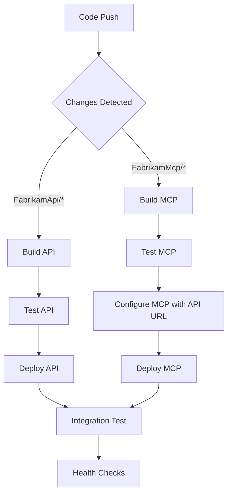

# 🚀 Azure Deployment & CI/CD Setup Guide

This guide walks through setting up automated deployments for both FabrikamApi and FabrikamMcp from a single repository using GitHub Actions.

## 🎯 Deployment Architecture

```
Single Repository (Monorepo)
├── FabrikamApi/          ← Deployed to Azure App Service
├── FabrikamMcp/          ← Deployed to Azure App Service  
├── .github/workflows/    ← CI/CD pipelines
└── Shared resources      ← Documentation, scripts, configs
```

### Benefits of This Approach:
- ✅ **Single source of truth** for both applications
- ✅ **Coordinated deployments** with dependency management
- ✅ **Shared CI/CD configuration** and secrets
- ✅ **Simplified repository management**
- ✅ **Easy cross-service integration** and testing

---

## � Prerequisites

Before starting the deployment, ensure you have:

- **Azure CLI** installed and updated to the latest version
- **PowerShell** (Windows PowerShell or PowerShell Core)
- **Azure subscription** with Contributor access
- **GitHub account** for repository and CI/CD setup

### Azure CLI Extensions

The deployment scripts will automatically install required Azure CLI extensions using:
```powershell
az config set extension.use_dynamic_install=yes_without_prompt
```

This automatically installs extensions like:
- `application-insights` - For Application Insights management
- `log-analytics` - For Log Analytics workspace operations  
- `webapp` - For enhanced App Service features

### Custom Domain Setup

If you plan to use custom domains, ensure you have:
- **DNS control** for your domain (e.g., levelupcsp.com)
- **SSL certificate** for HTTPS (App Service Certificate or Let's Encrypt)
- **CNAME records** configured before running the deployment

Required DNS records:
```
api-dev.levelupcsp.com    CNAME   your-api-app.azurewebsites.net
mcp-dev.levelupcsp.com    CNAME   your-mcp-app.azurewebsites.net
```

---

## �🛠️ Pre-Deployment Setup

### 1. Azure Resources Setup

#### Option 1: Use the Automated Script (Recommended)

Use the provided PowerShell script for easier deployment:

```powershell
# Basic deployment
.\Deploy-Azure-Resources.ps1 -SubscriptionId "your-subscription-id"

# With custom domain
.\Deploy-Azure-Resources.ps1 `
  -SubscriptionId "your-subscription-id" `
  -Environment "dev" `
  -CustomDomain "levelupcsp.com"

# Production deployment
.\Deploy-Azure-Resources.ps1 `
  -SubscriptionId "your-subscription-id" `
  -Environment "prod" `
  -CustomDomain "levelupcsp.com" `
  -Location "East US"
```

#### Option 2: Manual Step-by-Step

Create Azure resources for each environment manually:

```powershell
# Set variables
$environment = "dev"  # or "staging", "production"
$location = "East US 2" # or "East US"
$resourceGroup = "rg-fabrikam-$environment"
$subscriptionId = "your-subscription-id-here"
$customDomain = "levelupcsp.com"  # Replace with your custom domain

# Generate random suffix for globally unique resource names (4 characters)
$randomSuffix = -join ((65..90) + (97..122) | Get-Random -Count 4 | ForEach-Object {[char]$_})
Write-Host "Using random suffix: $randomSuffix" -ForegroundColor Green

# Configure Azure CLI to auto-install extensions without prompting
az config set extension.use_dynamic_install=yes_without_prompt

# Create resource group
az group create --name $resourceGroup --location $location

# Create Log Analytics Workspace (shared for monitoring)
az monitor log-analytics workspace create `
  --resource-group $resourceGroup `
  --workspace-name "log-fabrikam-$environment" `
  --location $location

# Get Log Analytics Workspace ID for Application Insights
$workspaceId = az monitor log-analytics workspace show `
  --resource-group $resourceGroup `
  --workspace-name "log-fabrikam-$environment" `
  --query id --output tsv

# Create Application Insights instances
az monitor app-insights component create `
  --app "appi-fabrikam-api-$environment" `
  --location $location `
  --resource-group $resourceGroup `
  --workspace $workspaceId `
  --kind web `
  --application-type web

az monitor app-insights component create `
  --app "appi-fabrikam-mcp-$environment" `
  --location $location `
  --resource-group $resourceGroup `
  --workspace $workspaceId `
  --kind web `
  --application-type web

# Get Application Insights connection strings
$apiInsightsKey = az monitor app-insights component show `
  --app "appi-fabrikam-api-$environment" `
  --resource-group $resourceGroup `
  --query connectionString --output tsv

$mcpInsightsKey = az monitor app-insights component show `
  --app "appi-fabrikam-mcp-$environment" `
  --resource-group $resourceGroup `
  --query connectionString --output tsv

# Create App Service Plans
az appservice plan create `
  --name "plan-fabrikam-api-$environment" `
  --resource-group $resourceGroup `
  --sku B1 --is-linux

az appservice plan create `
  --name "plan-fabrikam-mcp-$environment" `
  --resource-group $resourceGroup `
  --sku B1 --is-linux

# Create Web Apps with random suffixes for global uniqueness
$apiAppName = "fabrikam-api-$environment-$randomSuffix"
$mcpAppName = "fabrikam-mcp-$environment-$randomSuffix"

Write-Host "Creating API app: $apiAppName" -ForegroundColor Yellow
az webapp create `
  --name $apiAppName `
  --resource-group $resourceGroup `
  --plan "plan-fabrikam-api-$environment" `
  --runtime "DOTNETCORE:9.0"

Write-Host "Creating MCP app: $mcpAppName" -ForegroundColor Yellow
az webapp create `
  --name $mcpAppName `
  --resource-group $resourceGroup `
  --plan "plan-fabrikam-mcp-$environment" `
  --runtime "DOTNETCORE:9.0"

# Configure Application Insights for Web Apps
az webapp config appsettings set `
  --name $apiAppName `
  --resource-group $resourceGroup `
  --settings "APPLICATIONINSIGHTS_CONNECTION_STRING=$apiInsightsKey" `
             "ApplicationInsightsAgent_EXTENSION_VERSION=~3" `
             "ASPNETCORE_ENVIRONMENT=$environment"

az webapp config appsettings set `
  --name $mcpAppName `
  --resource-group $resourceGroup `
  --settings "APPLICATIONINSIGHTS_CONNECTION_STRING=$mcpInsightsKey" `
             "ApplicationInsightsAgent_EXTENSION_VERSION=~3" `
             "ASPNETCORE_ENVIRONMENT=$environment" `
             "FabrikamApi__BaseUrl=https://$apiAppName.azurewebsites.net"

# Configure custom domains (optional - requires DNS setup)
if ($customDomain) {
    Write-Host "Setting up custom domains..." -ForegroundColor Cyan
    
    # Custom domain names
    $apiCustomDomain = "api-$environment.$customDomain"
    $mcpCustomDomain = "mcp-$environment.$customDomain"
    
    Write-Host "API will be available at: https://$apiCustomDomain" -ForegroundColor Green
    Write-Host "MCP will be available at: https://$mcpCustomDomain" -ForegroundColor Green
    
    # Add custom domains (DNS must be configured first)
    Write-Host "Adding custom domain for API..." -ForegroundColor Yellow
    az webapp config hostname add `
      --webapp-name $apiAppName `
      --resource-group $resourceGroup `
      --hostname $apiCustomDomain
    
    Write-Host "Adding custom domain for MCP..." -ForegroundColor Yellow
    az webapp config hostname add `
      --webapp-name $mcpAppName `
      --resource-group $resourceGroup `
      --hostname $mcpCustomDomain
    
    # Enable HTTPS for custom domains (requires App Service Certificate or Let's Encrypt)
    Write-Host "Enabling HTTPS for custom domains..." -ForegroundColor Yellow
    az webapp config ssl bind `
      --certificate-thumbprint "your-certificate-thumbprint" `
      --ssl-type SNI `
      --name $apiAppName `
      --resource-group $resourceGroup
    
    az webapp config ssl bind `
      --certificate-thumbprint "your-certificate-thumbprint" `
      --ssl-type SNI `
      --name $mcpAppName `
      --resource-group $resourceGroup
    
    # Update MCP app settings to use custom API domain
    az webapp config appsettings set `
      --name $mcpAppName `
      --resource-group $resourceGroup `
      --settings "FabrikamApi__BaseUrl=https://$apiCustomDomain"
}

# Display final URLs
Write-Host "`n=== Deployment Complete ===" -ForegroundColor Green
Write-Host "API App Name: $apiAppName" -ForegroundColor Cyan
Write-Host "MCP App Name: $mcpAppName" -ForegroundColor Cyan
Write-Host "`nDefault URLs:" -ForegroundColor White
Write-Host "  API: https://$apiAppName.azurewebsites.net" -ForegroundColor Yellow
Write-Host "  MCP: https://$mcpAppName.azurewebsites.net" -ForegroundColor Yellow

if ($customDomain) {
    Write-Host "`nCustom URLs (after DNS setup):" -ForegroundColor White
    Write-Host "  API: https://api-$environment.$customDomain" -ForegroundColor Green
    Write-Host "  MCP: https://mcp-$environment.$customDomain" -ForegroundColor Green
}
```

### 2. Service Principal Creation

Create a service principal for GitHub Actions:

```powershell
# Configure Azure CLI to auto-install extensions (if not already set)
az config set extension.use_dynamic_install=yes_without_prompt

# Create service principal with contributor access (New method - recommended)
$sp = az ad sp create-for-rbac `
  --name "sp-fabrikam-deploy" `
  --role "Contributor" `
  --scopes "/subscriptions/$subscriptionId"

# Save the JSON output - you'll need this for GitHub secrets
echo $sp

# Alternative: If you need the old SDK format, manually format the output
$spObject = $sp | ConvertFrom-Json
$sdkFormat = @{
    clientId = $spObject.appId
    clientSecret = $spObject.password
    subscriptionId = $subscriptionId
    tenantId = $spObject.tenant
    activeDirectoryEndpointUrl = "https://login.microsoftonline.com"
    resourceManagerEndpointUrl = "https://management.azure.com/"
    activeDirectoryGraphResourceId = "https://graph.windows.net/"
    sqlManagementEndpointUrl = "https://management.core.windows.net:8443/"
    galleryEndpointUrl = "https://gallery.azure.com/"
    managementEndpointUrl = "https://management.core.windows.net/"
}

# Convert to JSON for GitHub secret
$sdkFormat | ConvertTo-Json
```

### 3. GitHub Repository Setup

#### Required GitHub Secrets:

Navigate to your GitHub repository → Settings → Secrets and variables → Actions:

| Secret Name | Description | Example Value |
|-------------|-------------|---------------|
| `AZURE_CREDENTIALS` | Service principal JSON from step 2 | `{"clientId": "...", "clientSecret": "...", ...}` |
| `AZURE_SUBSCRIPTION_ID` | Your Azure subscription ID | `12345678-1234-1234-1234-123456789012` |
| `AZURE_RESOURCE_GROUP_NAME` | Resource group name | `rg-fabrikam-dev` |

#### Optional GitHub Variables:

| Variable Name | Description | Default Value |
|---------------|-------------|---------------|
| `AZURE_LOCATION` | Azure region for deployments | `East US` |
| `DOTNET_VERSION` | .NET version to use | `9.0.x` |

---

## 🔄 CI/CD Workflows

### Available Workflows:

#### 1. **Individual Service Deployment**
- **`deploy-api.yml`** - Deploys only FabrikamApi
- **`deploy-mcp.yml`** - Deploys only FabrikamMcp

#### 2. **Full Stack Deployment**  
- **`deploy-full-stack.yml`** - Deploys both services with coordination

### Workflow Triggers:

#### Automatic Triggers:
- **Push to main branch** - Deploys to development environment
- **Path-based triggers** - Only deploys services that changed
  - Changes to `FabrikamApi/` → Triggers API deployment
  - Changes to `FabrikamMcp/` → Triggers MCP deployment

#### Manual Triggers:
- **Workflow Dispatch** - Manual deployment with environment selection
- **Environment Selection** - Choose development, staging, or production
- **Service Selection** - Deploy API only, MCP only, or both

### Deployment Process:



---

## 🌍 Environment Management

### Environment Strategy:

| Environment | Branch | Purpose | Auto-Deploy |
|-------------|--------|---------|-------------|
| **Development** | `main` | Latest stable code | ✅ Yes |
| **Staging** | `release/*` | Pre-production testing | ✅ Yes |
| **Production** | `production` | Live environment | ❌ Manual only |

### Environment-Specific Configuration:

#### Development
```bash
# App Names (with random suffix for uniqueness)
AZURE_API_WEBAPP_NAME=fabrikam-api-dev-{randomSuffix}
AZURE_MCP_WEBAPP_NAME=fabrikam-mcp-dev-{randomSuffix}

# Default URLs
API_URL=https://fabrikam-api-dev-{randomSuffix}.azurewebsites.net
MCP_URL=https://fabrikam-mcp-dev-{randomSuffix}.azurewebsites.net

# Custom Domain URLs (if configured)
API_CUSTOM_URL=https://api-dev.levelupcsp.com
MCP_CUSTOM_URL=https://mcp-dev.levelupcsp.com
```

#### Production
```bash
# App Names (with random suffix for uniqueness)
AZURE_API_WEBAPP_NAME=fabrikam-api-prod-{randomSuffix}
AZURE_MCP_WEBAPP_NAME=fabrikam-mcp-prod-{randomSuffix}

# Default URLs
API_URL=https://fabrikam-api-prod-{randomSuffix}.azurewebsites.net
MCP_URL=https://fabrikam-mcp-prod-{randomSuffix}.azurewebsites.net

# Custom Domain URLs (if configured)
API_CUSTOM_URL=https://api.levelupcsp.com
MCP_CUSTOM_URL=https://mcp.levelupcsp.com
```

---

## 🧪 Testing & Validation

### Automated Testing Pipeline:

1. **Unit Tests** - Run during build for both services
2. **Integration Tests** - Verify API-MCP communication
3. **Health Checks** - Ensure services are responding
4. **Smoke Tests** - Basic functionality validation

### Health Check Endpoints:

```bash
# API Health Check
curl https://fabrikam-api-{env}.azurewebsites.net/health

# MCP Status Check  
curl https://fabrikam-mcp-{env}.azurewebsites.net/status

# API Documentation
https://fabrikam-api-{env}.azurewebsites.net/swagger
```

### Post-Deployment Validation:

```powershell
# Test API connectivity
$apiUrl = "https://fabrikam-api-dev.azurewebsites.net"
$mcpUrl = "https://fabrikam-mcp-dev.azurewebsites.net"

# Check API health
Invoke-RestMethod "$apiUrl/health"

# Check MCP status
Invoke-RestMethod "$mcpUrl/status"

# Verify MCP can reach API
$mcpStatus = Invoke-RestMethod "$mcpUrl/status"
Write-Host "MCP connected to API: $($mcpStatus.ApiConnected)"
```

---

## 🛠️ Manual Deployment

### Using Azure Developer CLI (AZD):

```powershell
# Option 1: Deploy individually
cd FabrikamApi
azd up

cd ../FabrikamMcp
azd env set FABRIKAM_API_BASE_URL "https://fabrikam-api-dev.azurewebsites.net"
azd up

# Option 2: Use coordinated script
.\Deploy-Integrated.ps1 -EnvironmentName "dev" -Location "eastus"
```

### Using GitHub Actions Manually:

1. Go to **Actions** tab in your GitHub repository
2. Select **Deploy Full Stack** workflow
3. Click **Run workflow**
4. Choose environment and services to deploy
5. Monitor deployment progress

---

## 🔧 Configuration Management

### Service-to-Service Communication:

The MCP server needs to know the API URL. This is configured automatically during deployment:

```yaml
# In deploy-mcp.yml
- name: ⚙️ Configure App Settings
  run: |
    az webapp config appsettings set \
      --name ${{ env.AZURE_WEBAPP_NAME }} \
      --resource-group ${{ secrets.AZURE_RESOURCE_GROUP_NAME }} \
      --settings "FabrikamApi__BaseUrl=${{ steps.get-api-url.outputs.api_url }}"
```

### Environment Variables in Azure:

| Service | Setting | Purpose |
|---------|---------|---------|
| **FabrikamApi** | `ASPNETCORE_ENVIRONMENT` | Runtime environment |
| **FabrikamMcp** | `FabrikamApi__BaseUrl` | API connection string |
| **Both** | `AZURE_CLIENT_ID` | Managed identity (if used) |

---

## 🚨 Troubleshooting

### Common Issues:

#### 1. **Deployment Fails**
```bash
# Check GitHub Actions logs
# Look for specific error messages in the workflow run

# Check Azure deployment logs
az webapp log tail --name fabrikam-api-dev --resource-group rg-fabrikam-dev
```

#### 2. **MCP Can't Connect to API**
```bash
# Verify MCP configuration
az webapp config appsettings list --name fabrikam-mcp-dev --resource-group rg-fabrikam-dev

# Test API accessibility
curl https://fabrikam-api-dev.azurewebsites.net/health
```

#### 3. **GitHub Actions Permission Issues**
```bash
# Verify service principal has correct permissions
az role assignment list --assignee {service-principal-client-id}

# Check if resource group exists
az group show --name rg-fabrikam-dev
```

#### 4. **Custom Domain Issues**
```bash
# Verify DNS configuration
nslookup api-dev.levelupcsp.com

# Check custom domain status
az webapp config hostname list --webapp-name your-app-name --resource-group your-rg

# Verify SSL certificate binding
az webapp config ssl list --resource-group your-rg

# Test custom domain access
curl -I https://api-dev.levelupcsp.com/health
```

#### 5. **App Name Already Taken**
If you get "The name 'your-app-name' is not available":
```bash
# The script generates random suffixes, but if still taken:
# Manually set a different suffix
$randomSuffix = "xyz9"

# Or generate a new random suffix
$randomSuffix = -join ((65..90) + (97..122) | Get-Random -Count 6 | ForEach-Object {[char]$_})
```

### Debugging Steps:

1. **Check workflow logs** in GitHub Actions
2. **Verify Azure resources** exist and are running
3. **Test health endpoints** manually
4. **Check application logs** in Azure portal
5. **Validate configuration** settings

---

## 📊 Monitoring & Observability

### Application Insights:

Both services are configured with Application Insights for monitoring:

- **Performance metrics**
- **Error tracking** 
- **Request/response logging**
- **Custom telemetry**

### Key Metrics to Monitor:

| Metric | API | MCP | Purpose |
|--------|-----|-----|---------|
| **Response Time** | ✅ | ✅ | Performance monitoring |
| **Error Rate** | ✅ | ✅ | Reliability tracking |
| **Request Volume** | ✅ | ✅ | Usage analytics |
| **Dependency Calls** | ❌ | ✅ | MCP→API communication |

### Alerts Configuration:

```powershell
# Create alert for high error rate
az monitor metrics alert create \
  --name "High Error Rate - FabrikamApi" \
  --resource-group rg-fabrikam-dev \
  --scopes "/subscriptions/{sub-id}/resourceGroups/rg-fabrikam-dev/providers/Microsoft.Web/sites/fabrikam-api-dev" \
  --condition "avg requests/failed greater than 5" \
  --description "Alert when API error rate is high"
```

---

## 🎯 Best Practices Summary

### Repository Management:
- ✅ Use monorepo for related services
- ✅ Implement path-based deployment triggers
- ✅ Maintain separate build artifacts
- ✅ Use consistent naming conventions

### Deployment Strategy:
- ✅ Deploy API before MCP (dependency order)
- ✅ Use environment-specific configurations
- ✅ Implement health checks and integration tests
- ✅ Use staging slots for zero-downtime deployments

### Security:
- ✅ Use managed identities where possible
- ✅ Store secrets in GitHub Secrets
- ✅ Implement least-privilege access
- ✅ Enable application logs and monitoring

This setup provides a robust, scalable deployment pipeline for your Fabrikam project that can grow with your needs while maintaining separation of concerns and proper CI/CD practices.
