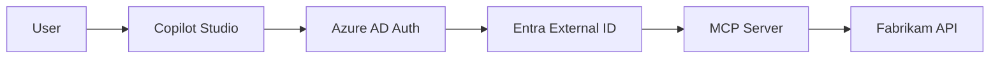

# 🛡️ Building a Fabrikam MCP Agent with Entra External ID (Coming Soon)

This guide will walk you through creating a Microsoft Copilot Studio agent that connects to your Fabrikam Modular Homes MCP server using **Microsoft Entra External ID** authentication, providing enterprise-grade security and user management.

## 🚧 Status: In Development

This authentication method is currently under development and will be available in a future release.

## 🎯 Planned Features

When available, the Entra External ID integration will provide:

### **Enterprise Authentication**
- OAuth 2.0 / OpenID Connect authentication
- Integration with Microsoft Entra External ID
- Single Sign-On (SSO) capabilities
- Multi-factor authentication (MFA) support

### **Advanced User Management**
- Azure AD user and group synchronization
- Role-based access control (RBAC)
- Conditional access policies
- Guest user support

### **Security & Compliance**
- Enterprise-grade security controls
- Audit logging and compliance reporting
- Token-based authentication with automatic refresh
- Integration with existing identity governance

## 📋 Prerequisites (When Available)

- Access to Microsoft Copilot Studio
- Access to Power Apps for creating custom connectors
- Microsoft Entra External ID tenant and configuration
- Your Fabrikam platform deployed with **EntraExternalId Mode** enabled
- Appropriate licenses for Entra External ID
- Azure AD administrative permissions

## 🔄 Current Alternatives

While this feature is in development, you can use:

### **For Production Environments**
- **[JWT Authentication Guide](./Copilot-Studio-JWT-Setup-Guide.md)** - Secure authentication with demo users and JWT tokens
- Custom OAuth 2.0 implementation with your existing identity provider

### **For Development & Demos**
- **[Disabled Authentication Guide](./Copilot-Studio-Disabled-Setup-Guide.md)** - Quick setup for demonstrations and development

## 📅 Timeline

- **Phase 1**: JWT Authentication ✅ **Complete**
- **Phase 2**: Basic Entra External ID integration (In Progress)
- **Phase 3**: Advanced enterprise features (Planned)
- **Phase 4**: Full compliance and governance features (Planned)

## 🔔 Get Notified

To be notified when Entra External ID support is available:

1. **Watch the Repository**: Star and watch the Fabrikam project repository for updates
2. **Check Release Notes**: Monitor the CHANGELOG.md for authentication updates
3. **Documentation Updates**: This guide will be updated with full implementation details

## 📞 Early Access & Feedback

If you have specific enterprise requirements or would like to participate in early testing:

1. Review the current JWT authentication implementation
2. Provide feedback on your enterprise authentication needs
3. Share your Entra External ID configuration requirements
4. Test the JWT implementation as a stepping stone

## 🛠️ Technical Preview

The implementation will likely include:

### **Authentication Flow**


### **Configuration Structure**
```yaml
Authentication:
  Mode: "EntraExternalId"
  EntraExternalId:
    TenantId: "your-tenant-id"
    ClientId: "your-client-id"
    ClientSecret: "from-key-vault"
    Scope: "api://fabrikam-api/.default"
    Authority: "https://login.microsoftonline.com/{tenant-id}"
```

### **Expected Swagger Security Definition**
```yaml
securityDefinitions:
  OAuth2:
    type: oauth2
    flow: accessCode
    authorizationUrl: https://login.microsoftonline.com/{tenant-id}/oauth2/v2.0/authorize
    tokenUrl: https://login.microsoftonline.com/{tenant-id}/oauth2/v2.0/token
    scopes:
      api://fabrikam-api/read: Read access to Fabrikam API
      api://fabrikam-api/write: Write access to Fabrikam API
```

---

**📧 Contact**: For questions about the roadmap or enterprise requirements, please create an issue in the project repository or contact the development team.

**🔄 Last Updated**: August 26, 2025
