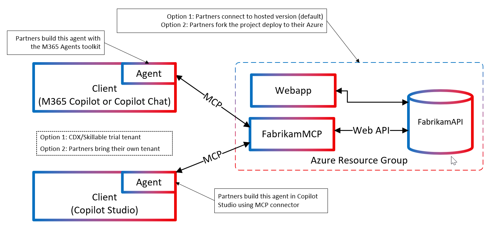

# 📋 COE Demo Documentation Index

**Welcome to the COE Fabrikam Project Demo! Start here for your complete setup journey.**

---

## 🏗️ What You're Building: Fabrikam Modular Homes

**A comprehensive business simulation platform for AI demonstrations and real-world scenario training.**

This project simulates **Fabrikam**, a fictional modular home builder, with realistic business operations that translate directly to customer scenarios. You'll build and deploy a complete business platform with AI integration in under 45 minutes.

### 🎯 **Business Value Demonstration**

This fast, easy-to-deploy project showcases the business value of:
- **AI Agents**: Natural language business intelligence queries
- **Model Context Protocol (MCP)**: Seamless AI integration with business systems  
- **Modern Cloud Architecture**: Scalable, secure, production-ready deployment
- **Real-time Analytics**: Live business dashboards and reporting

### 🏗️ **System Architecture**

**Two integrated services providing complete business functionality:**

#### **FabrikamApi** - Business Operations
- 📊 **Sales Analytics**: Order management, revenue tracking ($829K+ sample data)
- 📦 **Product Catalog**: Modular homes with specifications and inventory  
- 👥 **Customer Management**: CRM with order history and support integration
- 🖼️ **Asset Management**: Images, blueprints, and marketing materials

#### **FabrikamMcp** - AI Integration  
- 🗣️ **Natural Language Interface**: Query business data conversationally
- 🛠️ **10+ Business Tools**: Sales analytics, inventory checks, customer service
- ⚡ **Real-time Data**: Live API connections for current business information
- 🤖 **AI-Ready**: Optimized for Copilot Studio and other AI platforms

### 📊 **Sample Business Data**
- **8 Customers**: Business and individual buyers across regions
- **45+ Products**: Modular homes, ADUs, materials with full specifications  
- **15 Orders**: $829,482.50 in sample revenue with regional breakdowns
- **20 Support Tickets**: Realistic customer service workflows
- **Complete Asset Library**: House images, blueprints, marketing materials

### 🎯 **Customer Translation**
While this simulates a modular home business, the patterns apply directly to:
- **Manufacturing**: Inventory, orders, customer management
- **Retail**: Product catalogs, sales analytics, customer service
- **Professional Services**: Client management, project tracking, billing
- **Any Business**: The architecture scales to real customer scenarios

### ⚡ **Why This Demo Matters**

This isn't just a technical demonstration - it's a **business transformation showcase**:

- **⏱️ Fast Setup**: Complete deployment in 30-45 minutes vs. months of custom development
- **💰 Real ROI**: Demonstrates immediate business value of AI integration
- **🔄 Proven Patterns**: Production-ready architecture you can adapt to real customers
- **🎯 Measurable Impact**: Live analytics show concrete business intelligence capabilities
- **🚀 Scalable Foundation**: Modular design grows with business needs

**Bottom Line**: Show customers how AI agents can transform their business operations with minimal technical overhead and maximum business impact.

---

## 🎯 Choose Your Path

### 🆕 **New to GitHub?** 
**👉 Start Here**: [COE Complete Setup Guide](./COE-COMPLETE-SETUP-GUIDE.md)
- Complete walkthrough from GitHub account creation to production deployment
- Includes CI/CD setup and testing
- Estimated time: 30-45 minutes

### ⚡ **Quick Reference During Demo**
**👉 Keep This Open**: [COE Quick Reference Card](./organizer/COE-QUICK-REFERENCE.md)
- One-page cheat sheet with all key commands and URLs
- Perfect for printing or keeping open in a tab
- Troubleshooting quick fixes

### ☁️ **Ready to Deploy?**
**👉 Deploy Now**: [Deploy to Azure Guide](./organizer/DEPLOY-TO-AZURE.md)
- Direct deployment instructions
- Multiple authentication modes
- ARM template deployment

### 🤖 **Want AI Integration?**
**👉 Copilot Studio**: [Copilot Studio Setup](./Copilot-Studio-Disabled-Setup-Guide.md)
- Connect your deployed project to Copilot Studio
- Test AI-powered business intelligence tools
- Real-time data integration

---

## 📚 Additional Guides

### 🔧 **Advanced Configuration**
**👉 For Power Users**: [COE Advanced Setup Guide](./COE-ADVANCED-SETUP-GUIDE.md)
- Advanced authentication options
- Custom deployment scenarios
- Enterprise configuration

### 🔐 **Security & Privacy**
**👉 Security & Privacy**: [Security Guide](./organizer/SECURITY-AND-PRIVACY.md)
- Personal data protection guidelines
- Template-based workflow for multiple workshops
- Best practices for workshop organizers
- *Important: Read before handling participant data*

---

## 🚀 Demo Flow (Recommended Order)

1. **📝 [Setup Guide](./COE-COMPLETE-SETUP-GUIDE.md)** - Get your environment ready
2. **☁️ [Deploy to Azure](./organizer/DEPLOY-TO-AZURE.md)** - Deploy the infrastructure  
3. **⚡ [Quick Reference](./organizer/COE-QUICK-REFERENCE.md)** - Keep this handy during demo
4. **🤖 [Copilot Studio](./Copilot-Studio-Disabled-Setup-Guide.md)** - Test AI integration

## 🎪 What You'll Build Today

By the end of this demo, you'll have:

✅ **Your own GitHub fork** of the Fabrikam project  
✅ **Azure infrastructure** running the API and MCP services  
✅ **Automated CI/CD** pipeline deploying your changes  
✅ **Authentication system** with demo users and JWT tokens  
✅ **Business intelligence API** with customers, orders, and analytics  
✅ **AI integration** through Copilot Studio (optional)

## 🎯 Key Technologies Demonstrated

- **☁️ Azure**: App Service, Container Apps, Key Vault, Application Insights
- **🔄 DevOps**: GitHub Actions, automated deployment, infrastructure as code
- **🔐 Security**: JWT authentication, role-based access, Azure managed identity
- **🤖 AI**: Model Context Protocol (MCP), Copilot Studio integration
- **💻 Development**: .NET 9, ASP.NET Core, Entity Framework, modern C# patterns

## 💡 Tips for Success

### **For Presenters**
- Review the Quick Reference Card before your demo
- Test the Copilot Studio integration beforehand
- Have backup queries ready if one doesn't work
- Emphasize the business value, not just the technical features

### **For Participants**
- Follow the setup guide step-by-step
- Don't skip the browser profile setup - it prevents conflicts
- Keep the Quick Reference handy during the demo
- Ask questions - this is about learning business scenarios

### **Technical Notes**
- All deployments use secure, template-based workflows
- Sample data is fictional but realistic for business scenarios
- The architecture supports both demo and production environments
- Authentication can be enabled for real customer deployments

## 🆘 Need Help?

**During the demo:**
- Ask questions in chat
- Reference the Quick Reference card
- Workshop organizer available for assistance

**After the demo:**
- Check the [main documentation](../../docs/DOCUMENTATION-INDEX.md)
- Review [GitHub Issues](https://github.com/davebirr/Fabrikam-Project/issues)
- Explore the [architecture guides](../../docs/architecture/)

If you're following along on a tablet or mobile device:
- Use the Quick Reference card for essential commands
- The Azure Portal works well on mobile browsers
- GitHub's mobile interface supports all necessary operations
- Consider using Azure Cloud Shell app for command-line operations

---

## 📁 Workshop Folder Structure

This workshop is organized for clean participant experience:

- **Main Folder** (this level): Essential participant guides
  - `README.md` - Start here (this file)
  - `COE-COMPLETE-SETUP-GUIDE.md` - Complete setup walkthrough
  - `COE-ADVANCED-SETUP-GUIDE.md` - Advanced configuration options
  - `Copilot-Studio-Disabled-Setup-Guide.md` - AI integration guide

- **`organizer/`** - Workshop organizer materials (preparation, provisioning, security)
- **`scripts/`** - PowerShell automation scripts (admin use)
- **`config/`** - Configuration templates and files

**Participants**: Focus on the main folder guides - the subfolders are for workshop organizers.

---

**🎉 Ready to get started? Jump into the [Complete Setup Guide](./COE-COMPLETE-SETUP-GUIDE.md)!**

*This demo showcases modern Azure development practices, CI/CD automation, and AI integration - perfect for understanding how to build and deploy cloud-native applications.*
